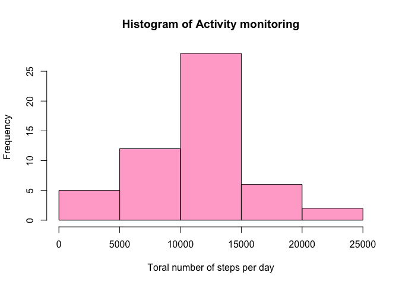
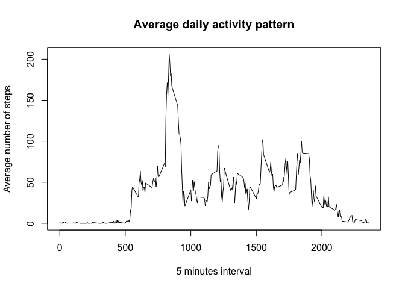
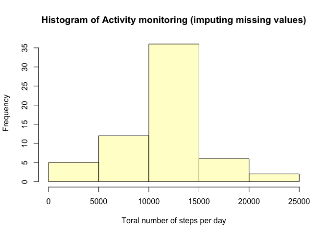
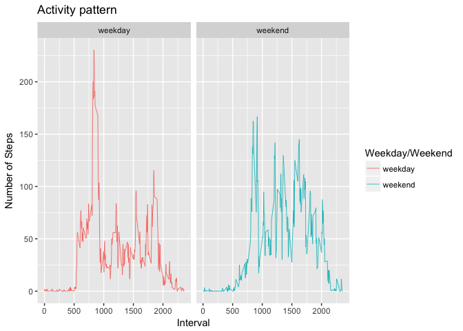

# Reproducible Research: Peer Assessment 1
Nguyen Bao-Khoi  
7/23/2017  

## Loading and preprocessing the data

```r
#Download and unzip Datata
path = file.path(getwd())
destFile <- file.path(path,"activityMonitoringData.zip")
unzipDir <- file.path(path,"activityMonitoringData")
#Download only if no file is dowloaded
if(!file.exists(destFile)) {
  download.file(url = "https://d396qusza40orc.cloudfront.net/repdata%2Fdata%2Factivity.zip", method = "curl", 
                destfile = destFile)
  unzip(destFile,exdir=unzipDir)
}
#Load file in ad dataframe
if (!exists("dataLoad")) {
  dataLoad <- read.csv(file = file.path(unzipDir,"activity.csv"), header = TRUE)
} 
#Use dplyer package to compute sum, mean, and median of steps per day
# Install if not yet installed 
#install.packages("dplyr")
library(dplyr)
```

```
## 
## Attaching package: 'dplyr'
```

```
## The following objects are masked from 'package:stats':
## 
##     filter, lag
```

```
## The following objects are masked from 'package:base':
## 
##     intersect, setdiff, setequal, union
```

```r
#Use ggplot2 package to draw nice graphics
# Install if not yet installed 
#install.packages("ggplot2")
library(ggplot2)
```


## What is mean total number of steps taken per day?

```r
#Remove missing steps observation (NA)
noNAData <- dataLoad[!is.na(dataLoad$steps),]

#mean total number of steps taken per day

#Compute total of steps per day and put to a daframe with summarise function group by date
nbStepsPerDay <- data.frame(summarise(group_by(noNAData, date), sum(steps)))

#Draw histogram of total number of steps per day (color of bars = pink)
hist(main="Histogram of Activity monitoring", nbStepsPerDay$sum.steps. ,
     xlab = "Toral number of steps per day",  col=rgb(1,0,0.5,0.4))
```

<!-- -->


```r
## What is the average daily activity pattern?
#average daily activity pattern
#For this part, we ignore missing values
#Compute average number of steps taken per intervale, across all days and put it in data frame
meanStepsPerIntervale <- data.frame(summarise(group_by(noNAData, interval), mean(steps)))
#Remame the columns
names(meanStepsPerIntervale)<-c("interval","meanStep")

#plot the graph
plot(x=meanStepsPerIntervale$interval, y=meanStepsPerIntervale$meanStep, type = "l", xlab = "5 minutes interval", 
     ylab = "Average number of steps", main = "Average daily activity pattern")
```

<!-- -->


## Imputing missing values

```r
#Number of rows with missing steps value
sum(is.na(dataLoad$steps))
```

```
## [1] 2304
```

```r
#Imputing missing value of a 5 minute interval with mean of that interval
#Use merge : merge dataLoad with meanStepsPerIntervale, by interval column and put the result into a new dataframe
dataImputedNA <- merge(dataLoad, meanStepsPerIntervale, by.x = "interval", by.y = "interval")
#Update all missing step with the value of meanStep column
dataImputedNA[is.na(dataImputedNA$steps),"steps"]<- dataImputedNA[is.na(dataImputedNA$steps),"meanStep"]
#Drop the meanStep column
dataImputedNA<-subset(dataImputedNA, select=-c(meanStep))
#Compute new total steps per day
nbStepsPerDayFull <- data.frame(summarise(group_by(dataImputedNA, date), sum(steps)))
#Draw histogram of total number of steps per day (color of bars = pink)
hist(main="Histogram of Activity monitoring (imputing missing values)", nbStepsPerDayFull$sum.steps. ,
     xlab = "Toral number of steps per day",  col=rgb(1,1,0.5,0.4))
```

<!-- -->

```r
#Compute mean of steps per day with summarise and mean function
summarise(nbStepsPerDayFull, mean(sum.steps.))
```

```
##   mean(sum.steps.)
## 1         10766.19
```

```r
#Report median of total steps per day with summarise and median function
summarise(nbStepsPerDayFull, median(sum.steps.))
```

```
##   median(sum.steps.)
## 1           10766.19
```

## Are there differences in activity patterns between weekdays and weekends?

```r
#Create factor variable with 2 levels weekend and weekday
#Convert date string column to Date type
dataImputedNA$date<- as.Date(dataImputedNA$date)
weekdays <- c('Monday', 'Tuesday', 'Wednesday', 'Thursday', 'Friday')
#add a colum wDay indicating weekday or weekend for each dat
dataImputedNA$wDay <- c('weekend', 'weekday')[(weekdays(dataImputedNA$date) %in% weekdays)+1L]
#Compute the average number of steps group by wDay and interval
dataImputedNAMean<-data.frame(summarise(group_by(dataImputedNA, wDay, interval), mean(steps)))

#Draw a panel for 2 plots with ggplot2 library
ggplot(data=dataImputedNAMean, aes(x=interval, y=mean.steps., colour=wDay)) + geom_line(size=0.3) +
  labs(title="Activity pattern", y = "Number of Steps", x="Interval", color="Weekday/Weekend") + facet_grid(. ~ wDay) 
```

<!-- -->

